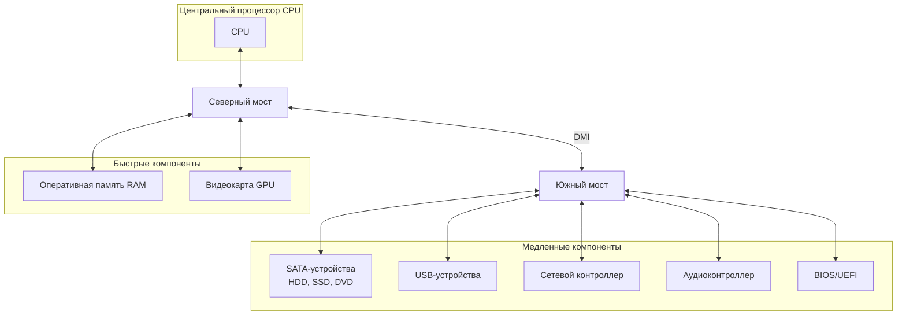
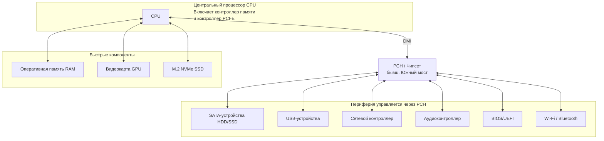

### **Конспект лекции для разработчиков. Основы Информационных Технологий**

**Тема урока 8: Блок-схема ПК. Концепция северного и южного мостов**

**Цель урока:** Разобраться в том, как компоненты ПК взаимодействуют друг с другом на системном уровне. Понять логику разделения обязанностей между северным и южным мостом и их эволюцию в современные архитектуры.

---

#### **1. Введение: Проблема "Разделения труда"**

Представьте, что процессор — это генеральный директор большой компании. Он не может лично бегать по каждому отделу, чтобы отдать распоряжение бухгалтерии или получить данные из архива. Для этого сущеятся менеджеры — высокоуровневые и низкоуровневые.

В классической архитектуре ПК такими "менеджерами" были **чипсеты**, состоящие из двух основных микросхем:
*   **Северный мост (North Bridge)** — менеджер высшего звена.
*   **Южный мост (South Bridge)** — менеджер среднего звена.

Эти "мосты" называются так из-за их традиционного расположения на материнской плате относительно процессора.

---

#### **2. Классическая архитектура: Двухмостовая схема**

Давайте разберем блок-схему, которая была стандартом долгие годы.

**Компоненты схемы:**

1.  **Центральный процессор (CPU):** Главное вычислительное устройство.
2.  **Северный мост (North Bridge):**
    *   **Назначение:** Обеспечивает высокоскоростное взаимодействие между CPU и самыми быстрыми компонентами системы.
    *   **Что соединяет?**
        *   **CPU** (через высокоскоростную шину FSB - Front-Side Bus).
        *   **Оперативная память (RAM)**.
        *   **Видеокарта (GPU)** через шину PCI Express x16.
    *   **Ключевая особенность:** Работает на очень высоких скоростях. Фактически, это "бутылочное горлышко" для данных между CPU, RAM и видеокартой.

3.  **Южный мост (South Bridge):**
    *   **Назначение:** Управление более медленными периферийными устройствами.
    *   **Что соединяет?** (Через северный мост!)
        *   **Накопители:** SATA-порты (для HDD, SSD, дисководов).
        *   **Сеть:** Ethernet-контроллер.
        *   **Звук:** Встроенная аудиокарта.
        *   **USB-порты** (мыши, клавиатуры, флешки).
        *   **BIOS/UEFI** — микросхема с прошивкой материнской платы.
        *   **Шины PCI** и другие слоты расширения.
    *   **Ключевая особенность:** Общается с CPU только через северный мост, что создает дополнительную задержку.

4.  **Шина DMI (Direct Media Interface):** Это высокоскоростное "шоссе", соединяющее северный и южный мосты.

**Проблема классической схемы:**
Северный мост становился "узким местом", так как через него проходил весь высокоскоростной трафик. Это ограничивало и скорость памяти, и видеокарты.

---

#### **3. Современная архитектура: Встроенный контроллер памяти**

Начиная с процессоров Intel Core i-series и AMD Ryzen, классический **северный мост был упразднен** и его ключевые компоненты **переехали прямо в процессор!**

**Что теперь находится внутри CPU:**
*   **Контроллер оперативной памяти:** CPU теперь общается с RAM напрямую, что резко увеличило скорость доступа.
*   **Контроллер PCI Express:** Высокоскоростные линии для видеокарты теперь управляются непосредственно процессором.

**Что изменилось в роли чипсета:**
То, что раньше называлось "южным мостом", теперь называется **"системной логикой"** или **"Platform Controller Hub (PCH)"** у Intel. Его задача осталась прежней — управление периферией, но теперь он соединяется с процессором через современную сверхбыструю шину DMI (версии 3.0 или 4.0).

**Преимущества современной архитектуры:**
*   **Снижение задержек:** Память и видеокарта общаются с CPU напрямую.
*   **Повышение пропускной способности:** Шины между CPU и RAM, CPU и GPU стали значительно быстрее.
*   **Энергоэффективность:** Упрощение схемы и уменьшение количества компонентов.

---

#### **4. Резюме для разработчика**

1.  **Эволюция:** Архитектура ПК эволюционировала от двухмостовой схемы к более эффективной, где ключевые контроллеры встроены в CPU.
2.  **Производительность:** Понимание этой схемы объясняет, почему, например, скорость RAM так критична — она подключена напрямую к процессору.
3.  **Периферия vs. Ядро системы:** Устройства ввода-вывода (USB, SATA) по-прежнему подключаются через чипсет (PCH), что создает небольшую, но существующую задержку по сравнению с напрямую подключенными компонентами (RAM, GPU, NVMe SSD).
4.  **Актуальность:** Термины "Северный/Южный мост" устарели для описания *современных* ПК, но являются **фундаментальным понятием** для понимания эволюции архитектуры и до сих пор встречаются в документации к одноплатным компьютерам (например, Raspberry Pi) и в устаревших системах.

---
### **Практическое задание**

**Цель:** Закрепить понимание логики взаимодействия компонентов ПК.

**Задача: Нарисовать блок-схему современного ПК.**

**Инструкция:**
1.  Возьмите лист бумаги или программу для рисования диаграмм (например, Draw.io, Miro, Lucidchart).
2.  В центре листа разместите **Центральный процессор (CPU)**.
3.  Нарисуйте и подпишите компоненты, которые подключены к процессору **напрямую** (самые быстрые). Используйте сплошные линии.
    *   *Подсказка: Оперативная память, видеокарта, высокоскоростной NVMe SSD.*
4.  Ниже CPU нарисуйте блок **Чипсет (PCH)**.
5.  Соедините CPU и PCH линией и подпишите ее **DMI**.
6.  Нарисуйте и подпишите компоненты, которые подключаются к системе **через PCH** (периферия). Используйте пунктирные линии или линии другого цвета.
    *   *Подсказка: SATA HDD/SSD, USB-устройства, сетевая карта, звуковая карта, Wi-Fi-адаптер.*
7.  Подпишите, какие контроллеры теперь встроены в сам CPU (контроллер памяти, контроллер PCIe).

**Что проверить в своей схеме:**
*   Видеокарта подключена напрямую к CPU или к PCH? (Правильно: к CPU).
*   Оперативная память подключена к PCH? (Неправильно! Она подключена напрямую к CPU).
*   SATA-диск подключен к CPU? (Нет, он подключен через PCH).