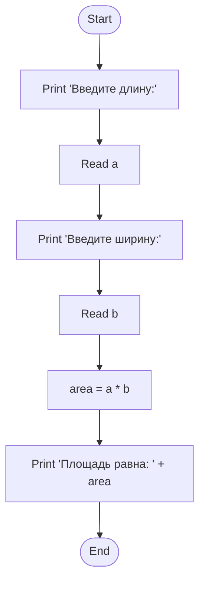

### **Понятие блок-схемы. Базовые элементы.**
#### **1. Понятие блок-схемы**

**Блок-схема** — это способ графического представления алгоритма, в котором используются стандартные геометрические фигуры (блоки) для отображения шагов алгоритма и стрелки для показа последовательности их выполнения.

**Назначение и преимущества:**
*   **Визуализация логики:** Позволяет наглядно увидеть последовательность действий, ветвления и циклы в алгоритме.
*   **Проектирование:** Используется на этапе проектирования программы для проработки её логики до написания кода.
*   **Документирование:** Служит формой документации, которая понятна даже тем, кто не знаком с конкретным языком программирования.
*   **Общение:** Упрощает обсуждение алгоритма между разработчиками, аналитиками и заказчиками.
*   **Выявление ошибок:** Визуальное представление помогает быстрее найти логические ошибки и неоптимальные решения.

**Основной принцип:** Каждый шаг алгоритма помещается в блок определенной формы. Блоки соединяются линиями (стрелками), указывающими порядок выполнения.

---

#### **2. Базовые элементы блок-схем (ГОСТ)**

Для создания блок-схем используется набор стандартных символов. Вот основные из них:

| Фигура (Блок)                          | Назначение и описание                                                                                                                                                             | Пример использования                                                                                                |
| :------------------------------------- | :-------------------------------------------------------------------------------------------------------------------------------------------------------------------------------- | :------------------------------------------------------------------------------------------------------------------ |
| **Терминатор** <br> (Овал)             | **Начало или конец алгоритма.** Обозначает точку входа в алгоритм или выхода из него.                                                                                               | `Начало`, `Конец`, `Старт`, `Стоп`                                                                                 |
| **Процесс** <br> (Прямоугольник)       | **Выполнение одной или нескольких операций,** изменяющих значение, форму представления или расположение данных.                                                                   | `a = b + c`, `count += 1`, `x = int(input())`                                                                      |
| **Ввод/Вывод** <br> (Параллелограмм)   | **Операции ввода данных или вывода результатов.** Преобразования данных не происходит.                                                                                               | `Ввести n`, `Получить x`, `Вывести "Ответ: "`, `Напечатать result`                                                |
| **Решение** <br> (Ромб)                | **Проверка условия**. Имеет один вход и **два или более выходов**. Выходы помечаются словами «Да»/«Нет» или «+»/«-». Направление дальнейшего выполнения зависит от истинности условия. | `n > 0?`, `x == 10?`, `is_correct?`                                                                                |
| **Предопределённый процесс** <br> (Прямоугольник с двойными вертикальными линиями) | **Вызов вспомогательного алгоритма или функции,** который был описан отдельно. Упрощает схему, скрывая детали реализации.                                                           | `Вычислить корни уравнения`, `Отсортировать массив`, `Найти максимальный элемент`                                  |
| **Цикл** <br> (Шестиугольник)          | **Начало цикла со счётчиком.** Указывается начальное значение, конечное значение и шаг цикла.                                                                                        | `i = 0, n, 1` (для `for i in range(0, n)`)                                                                         |
| **Соединитель** <br> (Круг)            | **Обозначение связи между частями схемы,** разорванными на странице. Используется для избежания длинных пересекающихся линий. Внутри ставится уникальный номер или буква.             | Используется, когда стрелку необходимо перенести на другую часть листа.                                            |
| **Линия (стрелка)**                    | **Указание последовательности выполнения шагов.** Показывает переход от одного блока к другому.                                                                                      | ---                                                                                                                 |

---

#### **3. Пример построения простой блок-схемы**

**Задача:** Вычислить площадь прямоугольника. Алгоритм должен запросить у пользователя длину и ширину, произвести вычисление и вывести результат.

**Блок-схема:**
```
┌─────────────┐
│   Начало    │
└─────────────┘
       |
       V
┌─────────────────────────┐
│ Вывести "Введите длину:"│
└─────────────────────────┘
       |
       V
┌─────────────────┐
│   Ввести (a)    │
└─────────────────┘
       |
       V
┌──────────────────────────┐
│ Вывести "Введите ширину:"│
└──────────────────────────┘
       |
       V
┌─────────────────┐
│   Ввести (b)    │
└─────────────────┘
       |
       V
┌─────────────────────┐
│  area = a * b       │
└─────────────────────┘
       |
       V
┌─────────────────────────────────┐
│ Вывести "Площадь равна: " + area│
└─────────────────────────────────┘
       |
       V
┌─────────────┐
│    Конец    │
└─────────────┘
```



    https://mermaid.live/edit#pako:eNpVjU9vgkAQxb_KZk5tgkb-iHQPTSq0Xkzag6eCh4mMLFF2ybLEWuC7d8GYtnOaN-_33nRwUDkBh-NZXQ4CtWG7JJPMzksaC102psJmz2az535DhlVK0rVn64eNYo1QdV3K4vHGr0eIxd12xIgZUcrTcLPiKf8uqWdJusXaqHr_19ldVM9e0_JD2Pr_jtBkU2_pEfkRZwfULEY9IeBAocscuNEtOVCRrnCU0I1uBkZQRRlwu-aoTxlkcrCZGuWnUtU9plVbCLDd58aqts7RUFJiofEXIZmTjlUrDXB3NVUA7-ALuO-Gc2-59CI_dBduuHoKHbjaczT3XS-IFl7ou0EYDA58Tz8X82i1HH4AQRFywA


**Пояснение:**
1.  Алгоритм начинается с блока **"Начало"**.
2.  Далее следует блок **"Вывод"** для печати приглашения ко вводу.
3.  Блок **"Ввод"** сохраняет введенное пользователем значение в переменную `a`.
4.  Процесс повторяется для переменной `b`.
5.  Блок **"Процесс"** выполняет вычисление площади.
6.  Блок **"Вывод"** отображает полученный результат.
7.  Алгоритм завершается в блоке **"Конец"**.

---

#### **4. Важные замечания**

*   **Стандартизация:** Использование общепринятых символов делает блок-схему понятной для всех специалистов.
*   **Читаемость:** Блок-схема не должна быть перегружена. Сложные алгоритмы часто разбивают на подзадачи, используя блок **"Предопределённый процесс"**.
*   **Однозначность:** Каждый блок должен содержать четкую и лаконичную запись действия.
*   **Направление:** Стандартным направлением потока выполнения считается направление **сверху вниз и слева направо**. Если поток идет в обратном направлении (например, в цикле), стрелки должны быть обязательно показаны.
